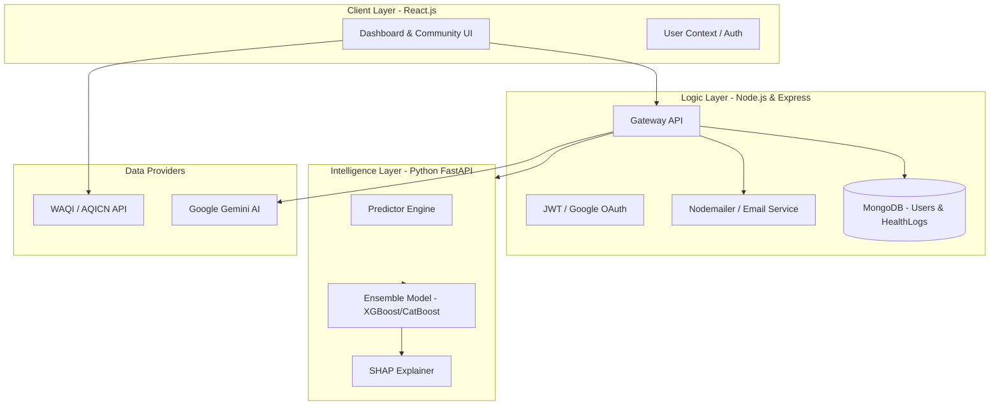

# 🌬️ **BreatheSafe**

### Breathe Better with BreatheSafe | Combating Air Pollution With Personalized Health Insights

BreatheSafe is a comprehensive microservices-based platform designed to transform raw environmental data into personalized, actionable health insights. By integrating real-time AQI monitoring with an Ensemble Machine Learning model, the system predicts individual health risks based on personal biological factors and environmental exposure.


---

## 🌍 Problem Statement

Air pollution is a growing global health crisis, claiming **~7 million lives every year**. Poor air quality triggers or worsens:

- **Respiratory diseases**
- **Cardiovascular conditions**
- **Allergies and asthma**

Vulnerable groups—children, the elderly, and people with pre-existing conditions—bear the brunt.  
While raw air-quality data is widely available, most people still lack **personalized, actionable guidance** to manage their exposure and health risks.

---


## 🏗️ System Architecture

The application follows a microservices architecture to ensure scalability and separation of concerns between the data processing, user management, and machine learning layers.



## 🔧 Tech Stack

- **MERN**: MongoDB · Express.js · React.js · Node.js  
- **Python**: Flask API (REST) · Pandas · scikit-learn · joblib  
- **Streamlit**: Interactive dashboards & visualizations  
- **Botpress**: Conversational assistant for quick AQI checks and health advice  
- **Architecture**: Microservices

---


##  ⭐ Feature Highlights

```mermaid
graph TD
    User --> Authentication
    Authentication --> Login
    Authentication --> SignUp
    Authentication --> GoogleAuth
    Login --> VerifyInput
    SignUp --> StoreCredentials --> Database
    StoreCredentials -->|redirect to Login page| Login
    GoogleAuth -->|Google Authentication| VerifyGmail

    Authentication --> Home
    Home --> |NLP Based Intelligent Responses| ChatBot
    Home --> MLModel
    Home --> EducationHub
    Home --> AirQualityDashboard
    Home --> CommunityHub


    EducationHub --> Explore
    EducationHub --> Quizzes
    EducationHub --> Learn
    EducationHub --> AQIReport

    Explore --> Badges
    Explore --> Videos
    Explore --> Scenarios

    Scenarios --> CompleteQuestions --> EarnBadges
    Quizzes --> CompleteQuiz --> EarnBadges

    AQIReport --> CurrentLocationAQI
    AQIReport --> AQIValues
    AQIReport -->  AQIWorldMap
    AQIReport --> WeatherImpact
    AQIReport --> HealthRecommendations

    CurrentLocationAQI --> PM2.5
    CurrentLocationAQI --> PM10
    CurrentLocationAQI --> O3
    CurrentLocationAQI --> CO
    CurrentLocationAQI --> NO2

AQIWorldMap[AQI World Map]


    WeatherImpact --> Temperature
    WeatherImpact --> Humidity
    WeatherImpact --> Visibility
    WeatherImpact --> WindSpeed
    HealthRecommendations --> GeneralTips

    AirQualityDashboard --> Dashboard
    Dashboard --> AQI
    Dashboard -->|send daily AQI report to user via gmail|EmailAutomation


    CommunityHub --> Community
    Community --> Reports
    Reports --> |Users can write their reports in report form|Submit
    Reports --> RecentReports

    Community --> GroupChallenges
    GroupChallenges --> ActiveChallenge --> JoinChallenge
    GroupChallenges --> Completed

    Community --> UserStories
    UserStories --> ShareStory
    UserStories --> OtherStories

  

    MLModel --> PollutionAnomolyDetection
    MLModel --> HealthRiskScorePrediction

  HealthRiskScorePrediction --> |takes factors like age, smoking habits, exposure hours, aqi, pollutants volume etc.| HealthRiskScore--> |Gemini API translates to Layman Terms| RiskCards

PollutionAnomolyDetection --> |takes season, average aqi, city information|Calculates --> | Sets anamoly flag for anomaly detection| 0/1 --> |For anomaly, sends alerts to user| AlertCards 


